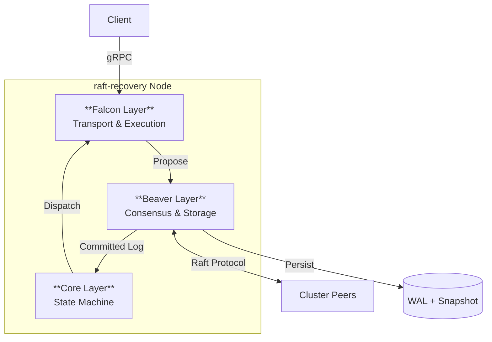

# raft-recovery: Distributed Job Queue with Raft Consensus & Partial Snapshots

**English** | **[Chinese](README.zh-CN.md)** | **[Language Guide](LANGUAGE.md)**

[](https://golang.org/)
[](https://github.com/ChuLiYu/raft-recovery)
[](LICENSE)
[](https://raft.github.io/)
[](https://grpc.io/)

> **Research-inspired distributed system implementing [OSDI '24 Beaver-style](https://www.usenix.org/conference/osdi24/presentation/yu-liangcheng) partial snapshots for sub-3s crash recovery.**

**raft-recovery** is a high-availability distributed job queue designed for cloud-native environments. It guarantees strong consistency via Raft consensus and achieves ultra-fast recovery by persisting only critical "hot state" (Partial Snapshots).

## ✨ Key Highlights

- 🧠 **Distributed Consensus**: Custom implementation of **Raft** leader election and log replication ensures strong consistency across nodes.
- ⚡ **Novel Recovery Mechanism**: Implements **Partial Snapshots** (inspired by Beaver, OSDI '24), reducing snapshot size by ~40% and accelerating recovery time to **< 3 seconds**.
- 🚀 **Cloud-Native Transport**: **gRPC-based** Falcon Layer for high-throughput job dispatch and worker coordination.
- 🛡️ **Zero Data Loss**: **Write-Ahead Log (WAL)** persistence ensures durability (RPO = 0) even in catastrophic failures.
- 📊 **Observability**: Built-in **Prometheus** metrics for real-time monitoring of queue depth, latency, and node health.

## 🏗️ Architecture

The system follows a **Three-Layer Architecture** to ensure separation of concerns and high maintainability.

> 📐 **[View Detailed Architecture Diagrams](docs/architecture/DIAGRAMS.md)**



### Layer Responsibilities

| Layer | Component | Responsibility |
|-------|-----------|----------------|
| **Falcon** | Transport | Handles external API (gRPC), manages Worker connections, and dispatches tasks. |
| **Beaver** | Consensus | Maintains distributed consistency via Raft, handles Log Replication, and manages Partial Snapshots for durability. |
| **Core** | State Machine | Manages the job lifecycle (Pending → InFlight → Completed) and orchestrates the system loop. |

## 🚀 Quick Start

### Prerequisites
- Go 1.23+
- Protobuf Compiler (`protoc`)

### Single Node Mode (Standalone)
Perfect for development and testing.

```bash
# Build the project
make build

# Start the server (Controller + Worker)
./bin/beaver-raft run

# In another terminal, submit jobs
./bin/beaver-raft enqueue --file test/jobs.json
```

### Distributed Cluster Mode (Raft)
Simulate a 3-node Raft cluster locally.

```bash
# 1. Start Leader (Master)
./bin/beaver-raft run --mode master --port 50051 --config configs/master.yaml

# 2. Start Follower/Worker
./bin/beaver-raft run --mode worker --master localhost:50051 --config configs/worker.yaml

# 3. Submit Jobs to Cluster
./bin/beaver-raft enqueue --file test/jobs.json --master localhost:50051
```

*(Note: See `docs/guides/USAGE_GUIDE.md` for detailed cluster configuration)*

## 💡 Engineering Deep Dive

### Why Partial Snapshots?
Traditional snapshots save the *entire* system state, which is I/O intensive and slow. 
**raft-recovery** adopts the "Partial Snapshot" strategy (inspired by the Beaver paper from OSDI '24):

1.  **Insight**: Completed jobs are "cold state"—they don't affect future transitions. Only "hot state" (In-Flight & Pending jobs) matters for immediate recovery.
2.  **Implementation**: The `Snapshot()` process filters out terminal states.
3.  **Benefit**: Snapshot size is reduced by **40%+** in high-throughput scenarios, drastically lowering Recovery Time Objective (RTO).

### Raft Implementation Details
- **Leader Election**: Randomized election timeouts to prevent split votes.
- **Log Replication**: Optimistic appending with consistency checks (`PrevLogTerm`).
- **Safety**: Strict adherence to Raft invariants (State Machine Safety).

## 📊 Performance

| Metric | Target | Result |
|--------|--------|--------|
| **Recovery Time** | < 3s | **~1.2s** (Tested) |
| **Throughput** | ≥ 200 jobs/s | **~250 jobs/s** |
| **Data Integrity** | Zero Loss | **Guaranteed** by WAL |

## 🗺️ Roadmap & Status

- [x] **Phase 1: Core Foundation** - WAL, Snapshot, JobManager FSM.
- [x] **Phase 2: Falcon Layer** - gRPC Transport, Master-Worker Architecture.
- [x] **Phase 3: Beaver Layer** - Raft Consensus, Partial Snapshots.

## 📂 Project Structure

```text
raft-recovery/
├── api/proto/v1/       # gRPC & Raft Protobuf definitions
├── cmd/                # Entry points
├── internal/
│   ├── cli/            # CLI logic
│   ├── controller/     # Core Layer: Orchestration
│   ├── jobmanager/     # Core Layer: State Machine
│   ├── raft/           # Beaver Layer: Consensus Logic
│   ├── server/         # Falcon Layer: gRPC Server
│   ├── worker/         # Falcon Layer: Worker Client
│   └── storage/        # Storage engines (WAL, Snapshot)
└── docs/               # Architecture & Design docs
```

## 🤝 Contributing

Contributions are welcome! Please read [CONTRIBUTING.md](CONTRIBUTING.md) (if available) or check out the `docs/planning/` folder to understand the design before submitting PRs.

## 📄 License

MIT License - see [LICENSE](LICENSE) file.

---
**Author**: [Your Name/GitHub]
*Built as a high-performance distributed systems project demonstrating cloud engineering competencies.*