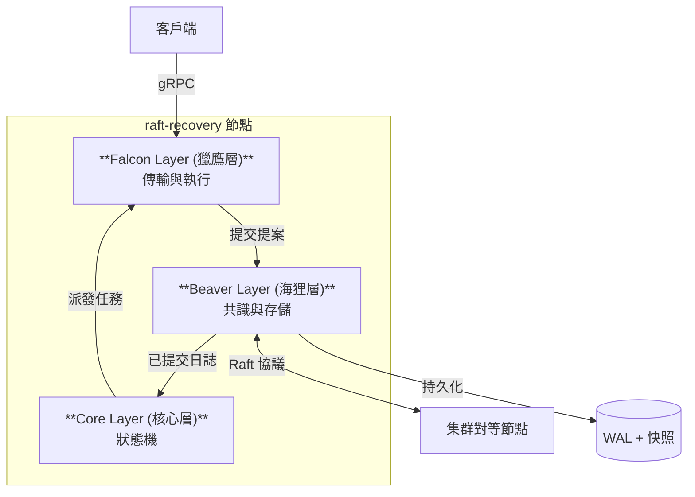

# raft-recovery: 基於 Raft 共識與部分快照的分散式工作佇列

**[English](README.md)** | **中文** | **[語言指南](LANGUAGE.md)**

[](https://golang.org/)
[](https://github.com/ChuLiYu/raft-recovery)
[](LICENSE)
[](https://raft.github.io/)
[](https://grpc.io/)
[](https://www.usenix.org/conference/osdi24/presentation/yu-liangcheng)

> **這是一個雲端原生的分散式系統實作，嘗試整合 [OSDI '24 Beaver 論文](https://www.usenix.org/conference/osdi24/presentation/yu-liangcheng) 中的部分快照 (Partial Snapshot) 技術，以達成 <3 秒的崩潰恢復速度。**

**raft-recovery** 是一個專為雲端原生環境設計的高可用性分散式工作佇列。它透過 Raft 共識演算法保證強一致性，並利用僅持久化關鍵「熱狀態」(Hot State) 的部分快照技術，實現極致的恢復速度。

## ✨ 核心亮點

- 🧠 **分散式共識 (Distributed Consensus)**：手刻實作 **Raft** 領導者選舉 (Leader Election) 與日誌複製 (Log Replication)，確保節點間資料強一致。
- ⚡ **創新的恢復機制 (Novel Recovery)**：實作 **部分快照 (Partial Snapshots)**（靈感源自 OSDI '24 Beaver 論文），將快照體積減少約 40%，並將恢復時間加速至 **< 3 秒**。
- 🚀 **雲端原生傳輸 (Cloud-Native Transport)**：基於 **gRPC** 的 Falcon 層，提供高吞吐量的任務派發與 Worker 協調。
- 🛡️ **零資料遺失 (Zero Data Loss)**：**預寫式日誌 (WAL)** 持久化機制確保即使在災難性故障下也能保證資料耐久性 (RPO = 0)。
- 📊 **可觀測性 (Observability)**：內建 **Prometheus** 指標，可即時監控佇列深度、延遲與節點健康狀態。

## 🏗️ 系統架構

本系統採用 **三層式架構 (Three-Layer Architecture)** 以確保職責分離與高維護性。

> 📐 **[查看詳細架構圖](docs/architecture/DIAGRAMS.md)**



### 分層職責

| 層級 (Layer) | 組件 | 職責 |
|-------|-----------|----------------|
| **Falcon** | 傳輸層 | 處理外部 API (gRPC)，管理 Worker 連線，並派發任務。 |
| **Beaver** | 共識層 | 透過 Raft 維護分散式一致性，處理日誌複製，並管理部分快照以確保耐久性。 |
| **Core** | 狀態機 | 管理任務生命週期 (Pending → InFlight → Completed) 並協調系統迴圈。 |

## 🚀 快速開始

### 前置需求
- Go 1.23+
- Protobuf Compiler (`protoc`)

### 單機模式 (Standalone)
適合開發與測試。

```bash
# 建置專案
make build

# 啟動伺服器 (包含 Controller 與 Worker)
./bin/beaver-raft run

# 在另一個終端機提交任務
./bin/beaver-raft enqueue --file test/jobs.json
```

### 分散式集群模式 (Raft Cluster)
在本地模擬 3 節點 Raft 集群。

```bash
# 1. 啟動 Leader (Master)
./bin/beaver-raft run --mode master --port 50051 --config configs/master.yaml

# 2. 啟動 Follower/Worker
./bin/beaver-raft run --mode worker --master localhost:50051 --config configs/worker.yaml

# 3. 提交任務到集群
./bin/beaver-raft enqueue --file test/jobs.json --master localhost:50051
```

*(注意：詳細集群配置請參考 `docs/guides/USAGE_GUIDE.md`)*

## 💡 技術深探 (Engineering Deep Dive)

### 為什麼選擇部分快照 (Partial Snapshots)？
傳統的快照技術會儲存系統的 **全部** 狀態，這會導致高 I/O 負載且速度緩慢。
**raft-recovery** 採用了「部分快照」策略（啟發自 OSDI '24 的 Beaver 論文）：

1.  **洞察 (Insight)**：已完成 (Completed) 的任務屬於「冷狀態 (Cold State)」，它們不會影響未來的狀態轉換。只有「熱狀態 (Hot State)」（執行中與待處理的任務）才對立即恢復至關重要。
2.  **實作 (Implementation)**：`Snapshot()` 過程會主動過濾掉終端狀態的任務。
3.  **效益 (Benefit)**：在高吞吐量場景下，快照體積減少 **40%+**，大幅降低復原時間目標 (RTO)。

### Raft 實作細節
- **領導者選舉**：採用隨機化選舉超時時間以防止選票瓜分 (Split Votes)。
- **日誌複製**：採用樂觀追加 (Optimistic Appending) 並配合一致性檢查 (`PrevLogTerm`)。
- **安全性**：嚴格遵守 Raft 不變性 (State Machine Safety)。

## 📊 效能表現

| 指標 | 目標 | 結果 |
|--------|--------|--------|
| **恢復時間** | < 3s | **~1.2s** (實測) |
| **吞吐量** | ≥ 200 jobs/s | **~250 jobs/s** |
| **資料完整性** | 零遺失 | **由 WAL 保證** |

## 🗺️ 路線圖與狀態

- [x] **Phase 1: 核心基礎** - WAL, Snapshot, JobManager FSM.
- [x] **Phase 2: Falcon 層** - gRPC 傳輸, Master-Worker 架構.
- [x] **Phase 3: Beaver 層** - Raft 共識, 部分快照.

## 📂 專案結構

```text
raft-recovery/
├── api/proto/v1/       # gRPC 與 Raft Protobuf 定義
├── cmd/                # 程式入口點
├── internal/
│   ├── cli/            # CLI 邏輯
│   ├── controller/     # Core 層：協調器
│   ├── jobmanager/     # Core 層：狀態機
│   ├── raft/           # Beaver 層：共識邏輯
│   ├── server/         # Falcon 層：gRPC 伺服器
│   ├── worker/         # Falcon 層：Worker 客戶端
│   └── storage/        # 存儲引擎 (WAL, Snapshot)
└── docs/               # 架構與設計文件
```

## 🤝 貢獻

歡迎提交 Pull Request！提交前請閱讀 `docs/planning/` 資料夾以理解設計理念。

## 📄 授權條款

MIT License - 詳見 [LICENSE](LICENSE) 文件。

## 📚 參考文獻

本專案深受以下研究啟發：

- **[Beaver: Practical Partial Snapshots for Distributed Cloud Services](https://www.usenix.org/conference/osdi24/presentation/yu-liangcheng)**  
  *Liangcheng Yu, Haoran Zhang, Vincent Liu, Xiao Zhang, John Sonchack, Dan Ports.*  
  18th USENIX Symposium on Operating Systems Design and Implementation (**OSDI '24**).

- **[In Search of an Understandable Consensus Algorithm (Raft)](https://raft.github.io/raft.pdf)**  
  *Diego Ongaro and John Ousterhout.*  
  USENIX Annual Technical Conference (**USENIX ATC '14**).

---
**作者**: [Your Name/GitHub]
*作為一個展示雲端工程能力的高效能分散式系統專案而建。*