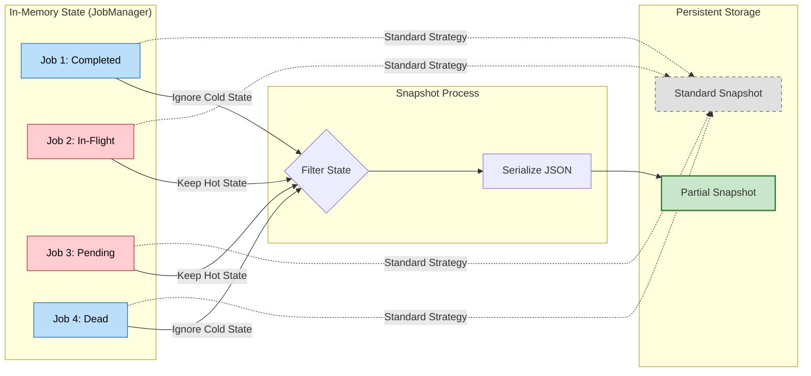
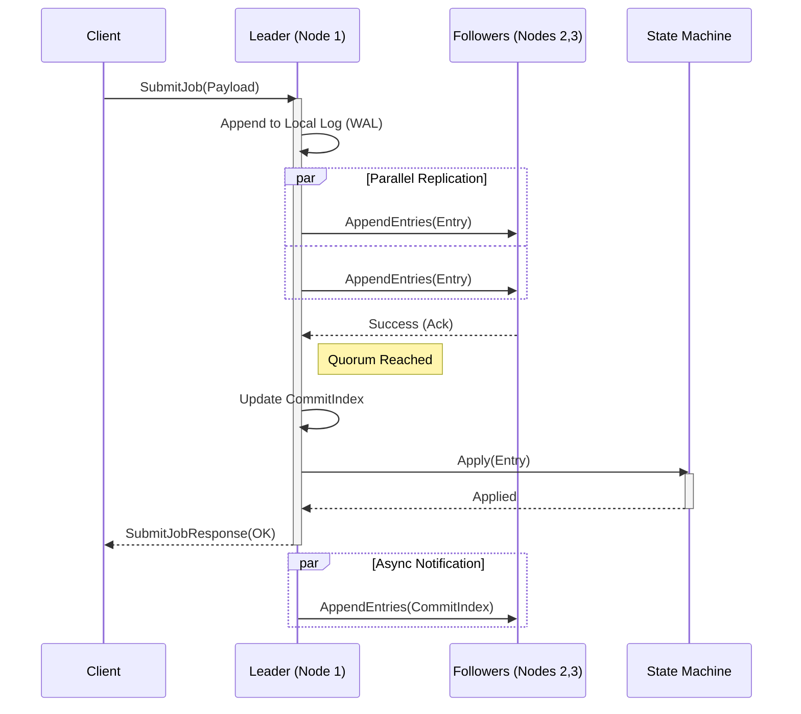
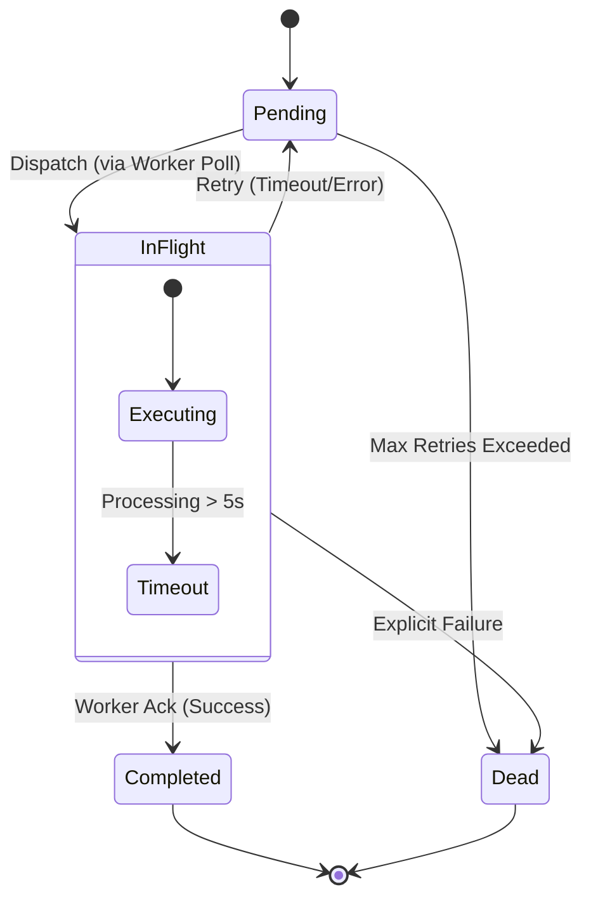

# Architecture Diagrams

This document contains detailed architectural diagrams for the **raft-recovery** system.
These diagrams are created using Mermaid.js syntax.

## 1. System Overview (Three-Layer Architecture)

This diagram illustrates the high-level components and their interactions within the unified layered architecture.

```mermaid
graph TB
    subgraph External["External World"]
        Client[Client App]
        Prometheus[Prometheus]
    end

    subgraph Cluster["raft-recovery Cluster"]
        direction TB
        
        subgraph Node1["Node 1 (Leader)"]
            style Node1 fill:#e1f5fe,stroke:#01579b
            
            subgraph Falcon1["Falcon Layer (Transport)"]
                style Falcon1 fill:#fff3e0,stroke:#ff6f00
                RPC1[gRPC Server]
                Worker1[Worker Pool]
            end
            
            subgraph Beaver1["Beaver Layer (Consensus)"]
                style Beaver1 fill:#e8f5e9,stroke:#2e7d32
                Raft1[Raft Module]
                WAL1[Write-Ahead Log]
                Snap1[Partial Snapshotter]
            end
            
            subgraph Core1["Core Layer (FSM)"]
                style Core1 fill:#f3e5f5,stroke:#7b1fa2
                Ctrl1[Controller]
                JM1[JobManager]
            end
        end

        subgraph Node2["Node 2 (Follower)"]
            style Node2 fill:#fafafa,stroke:#9e9e9e
            Raft2[Raft Module]
        end
        
        subgraph Node3["Node 3 (Follower)"]
            style Node3 fill:#fafafa,stroke:#9e9e9e
            Raft3[Raft Module]
        end
    end

    %% Data Flow
    Client -->|SubmitJob (gRPC)| RPC1
    RPC1 -->|Propose| Raft1
    Raft1 <-->|AppendEntries (Replication)| Raft2
    Raft1 <-->|AppendEntries (Replication)| Raft3
    
    Raft1 -->|Committed Log| Ctrl1
    Ctrl1 -->|Update State| JM1
    Ctrl1 -->|Dispatch Task| Worker1
    
    %% Persistence
    Raft1 -->|Persist| WAL1
    JM1 -.->|Save Hot State| Snap1
    
    %% Observability
    Prometheus -.->|Scrape /metrics| RPC1

    %% Styling
    classDef layer fill:#fff,stroke:#333,stroke-width:2px;
    classDef storage fill:#eee,stroke:#333,stroke-dasharray: 5 5;
```

## 2. Partial Snapshot Mechanism (The "Beaver" Logic)

This diagram explains how the system optimizes recovery time by persisting only "Hot State".



## 3. Raft Log Replication Flow

Sequence diagram showing how a job submission propagates through the cluster.



## 4. Job State Machine (Lifecycle)

State transitions within the Core Layer.


