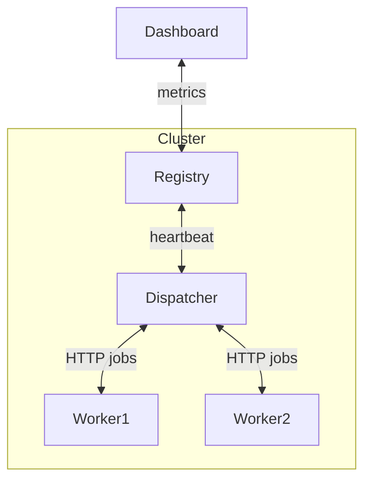

# Phase 2 — FalconQueue (Distributed Multi-Node)

## White Paper (High-Level Design)

### Value Proposition

- Evolve the single-node queue into a resilient multi-node system with inter-node communication.
- Demonstrate scalable cloud design patterns and fault tolerance in interviews and demos.

### Scope

- Node registry with registration and heartbeat (HTTP).
- Dispatcher responsible for job assignment over HTTP/gRPC.
- Workers pull jobs and acknowledge completion.
- Each node maintains local snapshot and WAL; central monitoring UI aggregates metrics.
- Serialization via Protocol Buffers or Gob (JSON-compatible).

### Key KPIs

| Metric                  | Target    | Notes                               |
|-------------------------|-----------|-------------------------------------|
| Throughput drop on node failure | < 40%   | Tested with three-node cluster      |
| Rebalance time          | < 5 s     | Heartbeat TTL 5 s with jitter       |
| RPC success rate        | > 98%     | Under fault-injection scenarios     |

### Risks and Mitigations

- **Duplicate delivery** → Idempotency keys for job deduplication.
- **Network partitions** → Lease-based dispatcher exclusivity.
- **WAL growth** → Log rotation, compaction, and checksums.

### Ten-Week Milestones

| Weeks | Focus                                            |
|-------|--------------------------------------------------|
| 1–2   | Registry service and heartbeat protocol (HTTP)   |
| 3–4   | Dispatcher job transfer flow and ACK protocol    |
| 5–6   | Serialization layer plus retry/backoff strategies|
| 7–8   | Central dashboard, chaos engineering scenarios   |
| 9–10  | WAL compaction, packaging demo deliverables      |

## Yellow Paper (Implementation Blueprint)

### Topology

### APIs

| Endpoint                               | Description            |
|----------------------------------------|------------------------|
| `POST /register {nodeId, role, cap}`   | Register node with role and capacity |
| `POST /heartbeat {nodeId, load}`       | Heartbeat with TTL 5 s + jitter      |
| `POST /pull {workerId, maxN}`          | Worker pulls up to `maxN` jobs       |
| `POST /ack {jobId, status}`            | Worker acknowledges job outcome      |

### Consistency Strategy

1. Single dispatcher ensured by lease.
2. If registry loses contact beyond TTL, trigger re-election.
3. Compact WAL every 1 MB or N events.

### Observability

- Track delivery success, retry rate, and P95 latency.
- Expose Prometheus metrics per node; central Grafana dashboard consumes them.
- Chaos scenarios: kill dispatcher, inject network delay, simulate partial failures.

